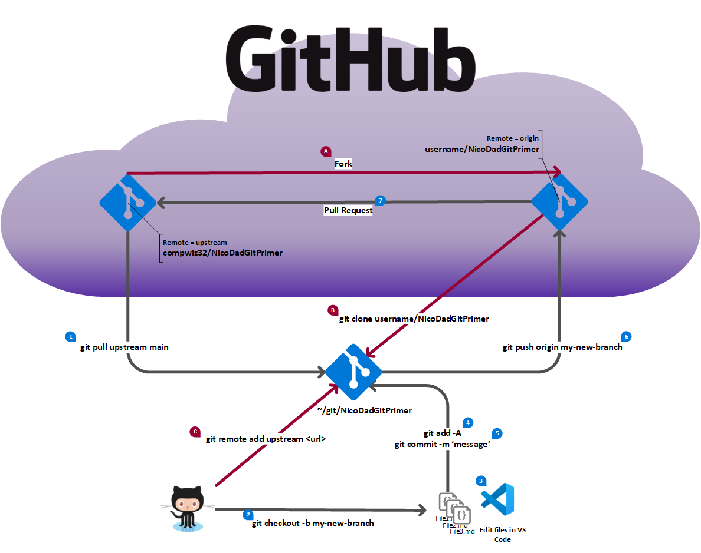

# GitHub workflow for a making changes

The following image illustrates the workflow for using Git and GitHub to create a new post for the
Community blog. The steps shown in red are a one-time action for each new repository you fork. The
numbered steps (in black) are described in the table below.

| Steps |     Description of steps     |                                                                                                                                                         Git command / GitHub actions                                                                                                                                                         |
| ----- | ---------------------------- | -------------------------------------------------------------------------------------------------------------------------------------------------------------------------------------------------------------------------------------------------------------------------------------------------------------------------------------------- |
| 0     | Checkout the master branch   | `git checkout master`                                                                                                                                                                                                                                                                                                                        |
| 1     | Sync the master branch       | `git pull upstream master` `git push origin master`                                                                                                                                                                                                                                                                                       |
| 2     | Create a new working branch  | git checkout -b my-new-branch                                                                                                                                                                                                                                                                                                                |
| 3     | Create new content           | Use VS Code to create new blog post                                                                                                                                                                                                                                                                                                          |
| 4-5   | Commit changes to local repo | `git add -A` `git commit -m 'commit message'`                                                                                                                                                                                                                                                                                             |
| 6     | Push working branch to fork  | git push origin my-new-branch                                                                                                                                                                                                                                                                                                                |
| 7     | Submit pull request          | Go to `https://github.com/<your_github_username>/NicoDadGitPrimer/pulls` and click the **New pull request** button.  `Base repository: compwiz32/NicoDadGitPrimer base: master <-- head repository: <your_github_username>/NicoDadGitPrimer compare: my-new-branch`  Fill out the pull request description and click **Submit**. |
| 8     | PR is reviewed               | Make the necessary changes based on the review feedback.                                                                                                                                                                                                                                                                                     |
| 9     | PR is merged                 | Go to step 10                                                                                                                                                                                                                                                                                                                                |
| 10    | Cleanup unneeded branch info | `git checkout master` `git push origin --delete my-new-branch` `git branch -D my-new-branch`  The `git push` command deletes the branch in your fork and deletes the tracking branch from your local repo. The `git branch` command delete the branch from your local repo.                                                      |
| 11    | Start new post               | Go to step 0                                                                                                                                                                                                                                                                                                                                 |
